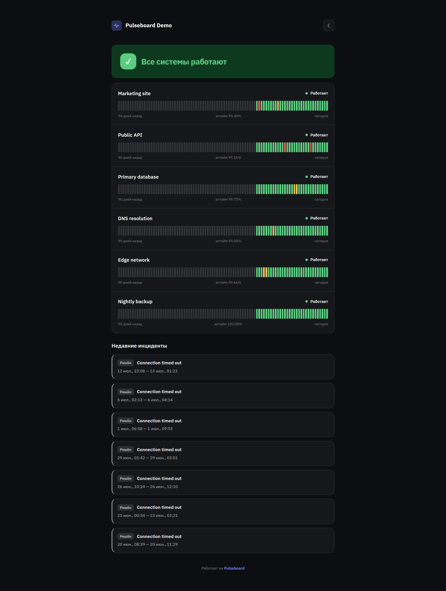
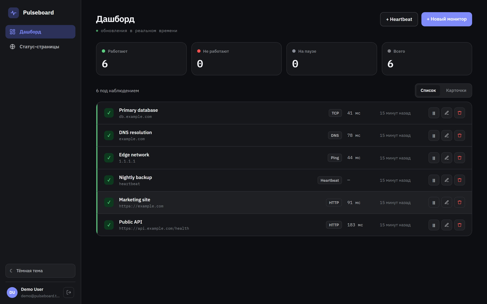
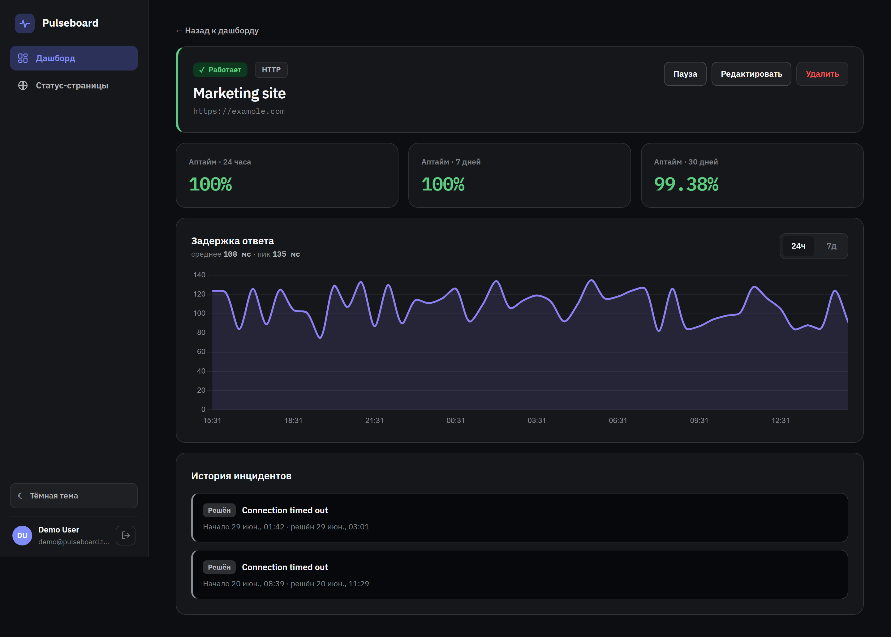
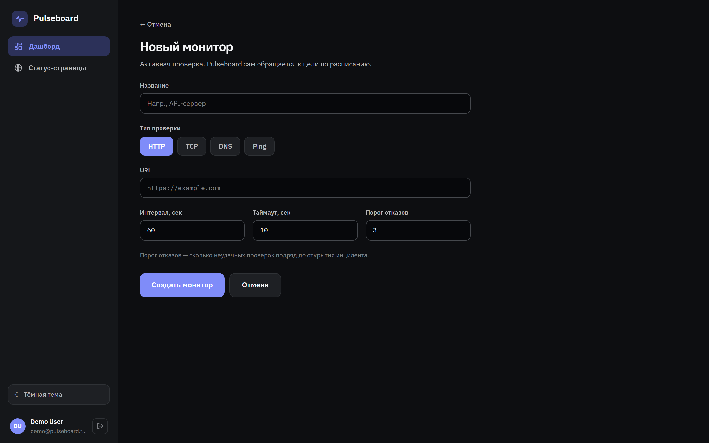
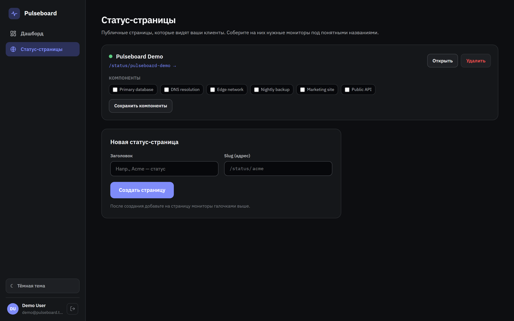
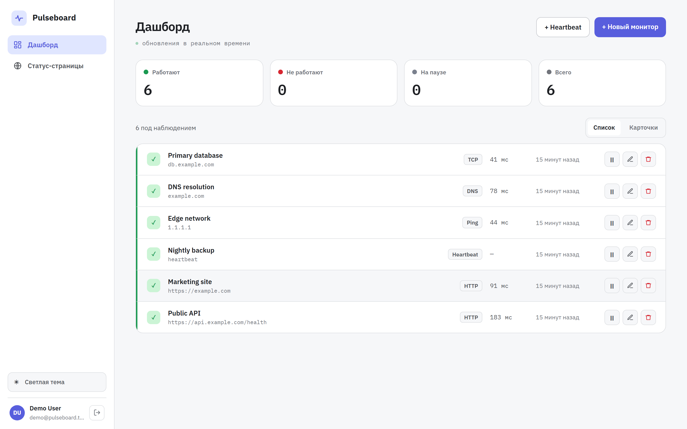
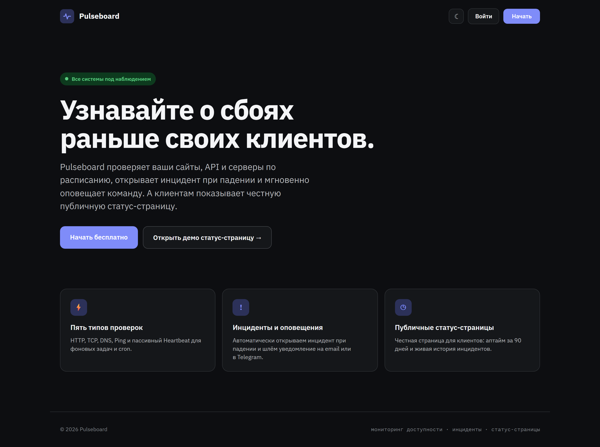
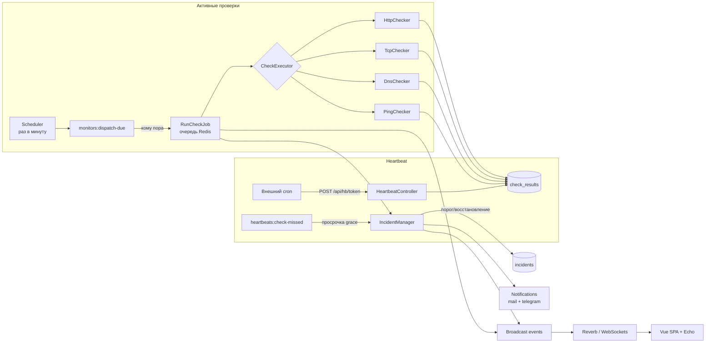
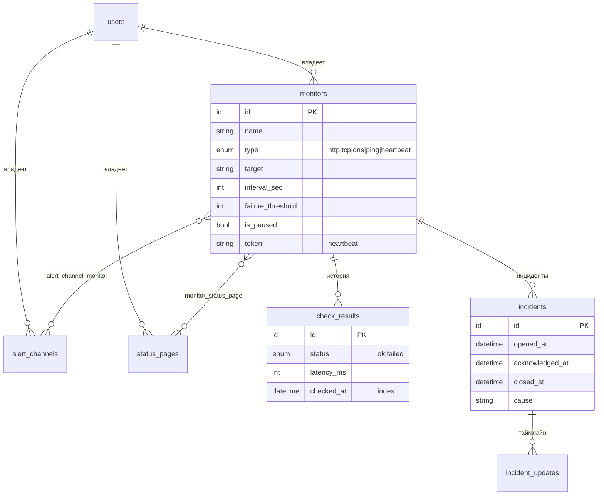

# Pulseboard


**Self-hosted мониторинг доступности со статус-страницами.** Заводите мониторы (сайт, API,
сервер, cron-задача), воркеры проверяют их по расписанию, при падении автоматически
открывается инцидент и уходит оповещение (email/Telegram), а метрики обновляются в
реальном времени по WebSockets. У каждого проекта есть публичная статус-страница для
клиентов.

Стек: **Laravel 13 + Vue 3 (TypeScript) SPA**, Sanctum (cookie-auth), Reverb (WebSockets),
Queues/Scheduler, Pest/PHPUnit, Larastan level 6. Инфраструктура — Sail (MySQL, Redis,
Mailpit), CI на GitHub Actions.

---

## Скриншоты

Публичная статус-страница — витрина для клиентов: 90-дневные полосы аптайма и история
инцидентов.



Дашборд — состояние всех мониторов с live-обновлением по WebSockets, светлая и тёмная тема.



Детали монитора — аптайм за 24ч/7д/30д, график задержки, лента инцидентов.



<details>
<summary>Ещё скриншоты (форма монитора, статус-страницы, светлая тема, лендинг)</summary>






</details>

---

## Возможности

- **Пять типов проверок**: HTTP, TCP, DNS, Ping (активные, проверяет сервер) и
  **Heartbeat** (пассивный — внешний cron сам пингует Pulseboard; тишина = проблема).
- **Движок проверок**: Scheduler раз в минуту выбирает «кому пора», исполнители работают в
  очереди (Redis), каждый монитор со своим интервалом/таймаутом/порогом отказов.
- **Инциденты**: порог подряд-неудач → авто-открытие, восстановление → авто-закрытие,
  ручной acknowledge, таймлайн обновлений.
- **Оповещения**: Laravel Notifications в email (Mailpit в dev) и Telegram; рассылка по
  включённым каналам монитора, троттлинг (один инцидент — одно оповещение).
- **Real-time дашборд**: события `CheckResultRecorded` / `IncidentOpened` / `IncidentClosed`
  вещаются в приватные каналы через Reverb, во Vue слушаются через Laravel Echo.
- **Аналитика**: uptime % за 24ч/7д/30д, серия латентности с downsampling, графики Chart.js.
- **Публичные статус-страницы** `/status/{slug}`: без авторизации, 90-дневные uptime-бары,
  лента инцидентов, никаких приватных данных.
- **Демо-сидер**: 30 дней реалистичной истории с инцидентами — после `--seed` всё выглядит
  живым.
- Тёмная и светлая тема, адаптив, интерфейс на русском.

---

## Архитектура



## Схема данных



Ключевые инженерные решения:

- Enum-типы в PHP + string-колонка в БД (без миграций `ALTER ENUM`), касты Eloquent.
- «Кому пора» и downsampling считаются в PHP по eager-загруженным данным —
  **портируемо между SQLite (тесты) и MySQL (прод)**, без несовместимых SQL-функций дат.
- Sanctum cookie-flow для SPA (не токены): CSRF + сессия на одном домене.
- Class-based broadcasting channel (`MonitorsChannel`) — авторизация приватного канала
  юнит-тестируется напрямую.

---

## Запуск

### Через Docker (Sail) — рекомендуется

```bash
git clone https://github.com/Raphael-Santi/pulseboard.git
cd pulseboard
cp .env.example .env
composer install
./vendor/bin/sail up -d
./vendor/bin/sail artisan key:generate
./vendor/bin/sail artisan migrate --seed        # демо-данные за 30 дней
./vendor/bin/sail npm install && ./vendor/bin/sail npm run build
```

Приложение — http://localhost, публичная демо-страница — http://localhost/status/pulseboard-demo

Для real-time и очередей запустите в отдельных терминалах:

```bash
./vendor/bin/sail artisan reverb:start      # WebSockets
./vendor/bin/sail artisan queue:work        # исполнители проверок и оповещения
./vendor/bin/sail artisan schedule:work     # планировщик проверок
```

### Без Docker (SQLite)

```bash
cp .env.example .env
composer install && npm install
php artisan key:generate
# SQLite:
touch database/database.sqlite
DB_CONNECTION=sqlite DB_DATABASE=$(pwd)/database/database.sqlite php artisan migrate --seed
npm run build
DB_CONNECTION=sqlite php artisan serve
```

---

## Как протестировать функционал

**Готовый демо-аккаунт** (создаётся сидером, полностью наполнен историей):

- URL: http://localhost (или http://127.0.0.1:8000 без Docker)
- Логин: `demo@pulseboard.test`
- Пароль: `password`

**Свой аккаунт с нуля:**

1. Откройте главную → **«Начать»** → заполните имя/email/пароль → вы в дашборде.
2. **«+ Новый монитор»** — заведите HTTP-монитор (например `https://example.com`), интервал
   и таймаут в секундах.
3. Запустите `queue:work` и `schedule:work` (см. выше) — через минуту появятся первые
   проверки, статус и график.
4. **«+ Heartbeat»** — создайте heartbeat-монитор, скопируйте секретный ping-URL и дёрните
   его `curl -X POST <url>`; на детальной странице обновится «последний пинг».
5. **«Статус-страницы»** — создайте страницу, отметьте мониторы галочками, откройте
   публичную ссылку `/status/<slug>`.
6. Письма-оповещения смотрите в Mailpit: http://localhost:8025 (при запуске через Sail).

---

## Качество

- Тесты: **Pest/PHPUnit** (feature + unit исполнителей на локальных сокетах и фейк-часах),
  **Vitest** (сторы Pinia).
- Статический анализ: **Larastan (PHPStan) level 6**, строгие типы (`declare(strict_types=1)`),
  **vue-tsc** (TypeScript strict).
- Стиль: **Pint** (PHP), **ESLint + Prettier** (JS/Vue).
- CI (GitHub Actions) — два джоба: `php` (pint + phpstan + pest) и `node`
  (eslint + prettier + vue-tsc + vitest + build).

## Связь с портфолио

Pulseboard продолжает [netpulse](https://github.com/Raphael-Santi/netpulse) (системный
монитор доступности на чистом PHP: сырые сокеты tcp/http/dns/ping, инциденты, Telegram):
та же предметная область, но как полноценный SaaS — Laravel, Vue SPA, WebSockets,
многопользовательность, публичные статус-страницы.

## Роадмап

Осознанно вне текущего скоупа: команды/роли, Slack-оповещения, мульти-регион проверки,
e2e-тесты Playwright, экспорт метрик (Prometheus).
